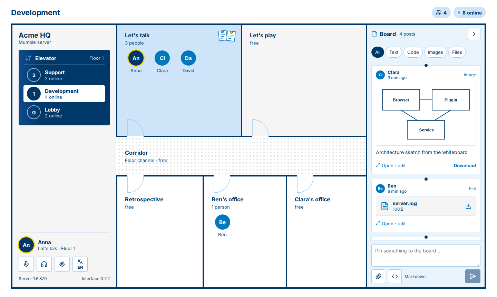

# Ruumble

[](https://github.com/Skrrytch/ruumble/actions/workflows/ci.yml) [](https://github.com/Skrrytch/ruumble/releases/latest) [](LICENSE)

An alternative web UI for [Mumble](https://www.mumble.info/): Ruumble shows the channels of a Mumble server as an **office building** in the browser. You see who is where, move to another room with a click, and pin notes, code, images and files to the room's board. Voice still runs through the regular Mumble client.

## Guides

| For | Guide |
|---|---|
| **Users**: install the plugin, pair, use Ruumble | [docs/user-guide.md](docs/user-guide.md) |
| **Operators** of a Mumble server: set up Ruumble next to it | [docs/operations.md](docs/operations.md) |
| **Developers**: build, test, contribute | [docs/development.md](docs/development.md) |



## Features

- Top-level channels become **floors**, the floor channel itself is the **corridor**, second-level channels are **rooms**. The order follows the channels' **position** in Mumble; the first channel is the ground floor.
- Floors nested deeper or with more than 8 rooms are locked in the elevator; linked channels are hidden.
- **Presence**: talking indicator, mute and deafen, quiet and away, listeners, recording, Mumble avatars.
- **Board** in every room: text (Markdown), source code with highlighting, images with full-screen zoom, files up to 10 MB, quick reactions, shared task lists, one post kept on top, search and filter. Everyone in the room can read and edit it; the others get a short notice in their Mumble log.
- **Languages**: German if the browser prefers German, otherwise English.

Full list and plans: [docs/features.md](docs/features.md).

**Requirements:** Mumble server 1.5 or later with Ice enabled, Mumble client 1.4 or later on Linux or Windows. Details: [docs/operations.md](docs/operations.md#requirements).

> **Download:** [latest release](https://github.com/Skrrytch/ruumble/releases/latest) with the Docker image `ghcr.io/skrrytch/ruumble` (linux/amd64, linux/arm64) and the plugin for Linux and Windows. Changes: [CHANGELOG.md](CHANGELOG.md).

## Architecture

```
Browser ──http(s)──▶ Ruumble service ──Ice (read-only)──▶ Mumble server
                          ▲
                          │ WebSocket (outgoing)
                     Ruumble plugin ──plugin API──▶ Mumble client (audio unchanged)
```

- **Mumble stays unchanged.** Ruumble uses the regular Mumble client and the official server image.
- **Plugin** (`plugin/`): provides the user's identity and talking state, and performs moves, mute and deafen in the user's own client.
- **Service** (`bridge/`): reads the channel tree and user state via Ice **read-only**, serves the web UI, forwards commands to the plugin and stores the boards.
- **Web UI** (`web/`): Svelte. It derives the building from the channel tree.

## More documentation

| Document | Content |
|---|---|
| [docs/features.md](docs/features.md) | What Ruumble supports today and what is planned |
| [docs/decisions/](docs/decisions/README.md) | Architecture decision records |
| [docs/mumble-interfaces.md](docs/mumble-interfaces.md) | Every Mumble interface Ruumble uses, with references into the Mumble source |
| [third_party/mumble/](third_party/mumble/README.md) | The two interface files taken from Mumble |

## License

[BSD-3-Clause](LICENSE). The files in `third_party/mumble/` are under Mumble's BSD-3 license (© The Mumble Developers).

The service uses Ice for JavaScript (GPL-2.0). A distributed Docker image of the service is therefore GPL-2.0 as a whole (ADR-0006); this does not apply to the web UI or the plugin. Third-party components: [THIRD_PARTY_NOTICES.md](THIRD_PARTY_NOTICES.md).

Ruumble is not affiliated with or endorsed by the Mumble project.
