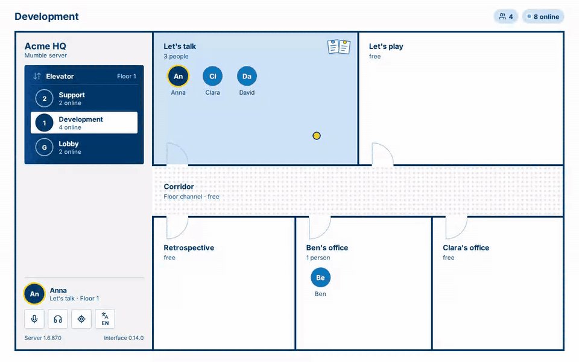

# Ruumble

[](https://github.com/Skrrytch/ruumble/actions/workflows/ci.yml) [](https://github.com/Skrrytch/ruumble/releases/latest) [](LICENSE)

**Your [Mumble](https://www.mumble.info/) server as an office building.** Ruumble is a web UI next to the regular Mumble client: the channels become floors and rooms, you see at a glance who sits where and who is talking, you move to another room with a click, and every room has a board for notes, code, images and files. Voice stays in Mumble, and Mumble itself stays unchanged.

> **Ruumble is an add-on, not a standalone app.** It needs a Mumble server that you run or administer, and it has two parts:
>
> - a small **service** (one Docker container) that the server operator runs next to the Mumble server. It needs access to the server's Ice interface and serves the web UI.
> - a **plugin** that every user installs once in their Mumble desktop client (Linux or Windows).
>
> Without your own Mumble server and the plugin in the clients there is nothing to see, except the demo below.

**[Try the demo](https://skrrytch.github.io/ruumble/)**: runs in the browser against a simulated server, no Mumble needed.



## Features

- **Building view:** top-level channels become floors, second-level channels rooms, the floor channel itself the corridor. The order follows the channels' position in Mumble.
- **Presence:** talking indicator, mute and deafen, quiet and away, listeners, recording, Mumble avatars.
- **One click to move:** Ruumble moves your own Mumble client, and mute and deafen work from the browser too.
- **Board in every room:** Markdown, source code with highlighting, images, files (10 MB by default), quick reactions, shared task lists, one post kept on top, search. The others in the room get a short notice in their Mumble log.
- **Care for admins:** whoever has Mumble's Write permission tends the stored data from a plant (delete old posts, export or move a board, tidy up after deleted rooms), changes the building's settings and revokes paired browsers.
- **German and English**, installable as a web app over HTTPS.

Full list and plans: [docs/features.md](docs/features.md).

## Quick start

**For server operators** (Docker; details and the setup next to an existing Mumble container in the [operations guide](docs/operations.md)). A new Mumble server with Ruumble, in an empty folder:

```sh
curl -fsSLO https://raw.githubusercontent.com/Skrrytch/ruumble/main/deploy/compose/mumble-with-ruumble.docker-compose.yml
curl -fsSLO https://raw.githubusercontent.com/Skrrytch/ruumble/main/deploy/compose/setup.sh
sh setup.sh && docker compose up -d
```

Then add the line `setup.sh` prints, e.g. `ruumble: http://192.168.1.10:64080`, to the description of the root channel in Mumble. That is how the plugins find Ruumble.

**For users** (details in the [user guide](docs/user-guide.md)):

1. Download the plugin from the Ruumble address (`…/download`) and install it in Mumble under *Configure → Settings → Plugins*.
2. Connect to the server: the plugin opens your browser with a pairing link.
3. From then on, open Ruumble at its address. That's it.

## Requirements

| | |
|---|---|
| Mumble server | 1.5 or newer, with Ice enabled (tested: 1.5.735, 1.6.870) |
| Mumble client | 1.4 or newer on **Linux** (x86_64) or **Windows** (x64); one plugin file for both. No macOS plugin yet. |
| Service | Docker, network access to the Mumble server's Ice port |
| Browser | a current Firefox, Chrome or Edge |

## How it works

```
Browser ──http(s)──▶ Ruumble service ──Ice (read-only)──▶ Mumble server
                          ▲
                          │ WebSocket (outgoing)
                     Ruumble plugin ──plugin API──▶ Mumble client (audio unchanged)
```

- The **service** (`bridge/`) reads the channel tree and user state via Ice, **read-only**. It serves the web UI, forwards commands to the plugin and stores the boards.
- The **plugin** (`plugin/`) tells the service who you are and when you talk, and carries out moves, mute and deafen in your own client. It only opens an outgoing connection.
- The **web UI** (`web/`, Svelte) derives the building from the channel tree.
- Talking state goes only to your own browser and is never stored. More in the [architecture decisions](docs/decisions/README.md).

## Documentation

| For | Guide |
|---|---|
| Users | [docs/user-guide.md](docs/user-guide.md): install the plugin, pair, use Ruumble |
| Operators | [docs/operations.md](docs/operations.md): set up Ruumble next to a Mumble server; from there HTTPS, backups and updates, troubleshooting |
| Developers | [docs/development.md](docs/development.md): build, test, release |
| Everyone | [CHANGELOG.md](CHANGELOG.md), [features and plans](docs/features.md), [Mumble interfaces used](docs/mumble-interfaces.md) |

## Icons

The Ruumble icon for portals, dashboards and bookmarks: [ruumble-icons.zip](https://github.com/Skrrytch/ruumble/releases/latest/download/ruumble-icons.zip) from the latest release, with the SVG, PNGs in 192 and 512 px (also as maskable icons with a full-bleed background), the Apple touch icon and `favicon.ico`. Every Ruumble instance also serves them at its root, e.g. `https://<your-ruumble>/icon-512.png`. The sources are in [`web/public/`](web/public/).

## Support and contributing

- Questions and ideas: [Discussions](https://github.com/Skrrytch/ruumble/discussions). Bugs and feature requests: [issues](https://github.com/Skrrytch/ruumble/issues).
- Security problems: please report them privately, see [SECURITY.md](SECURITY.md).
- Contributions are welcome, see [CONTRIBUTING.md](CONTRIBUTING.md).

## License

[BSD-3-Clause](LICENSE). The files in `third_party/mumble/` are under Mumble's BSD-3 license (© The Mumble Developers).

The service uses Ice for JavaScript (GPL-2.0), so the distributed Docker image is GPL-2.0 as a whole (ADR-0006). This does not apply to the web UI or the plugin. Third-party components: [THIRD_PARTY_NOTICES.md](THIRD_PARTY_NOTICES.md).

Ruumble is not affiliated with or endorsed by the Mumble project.
